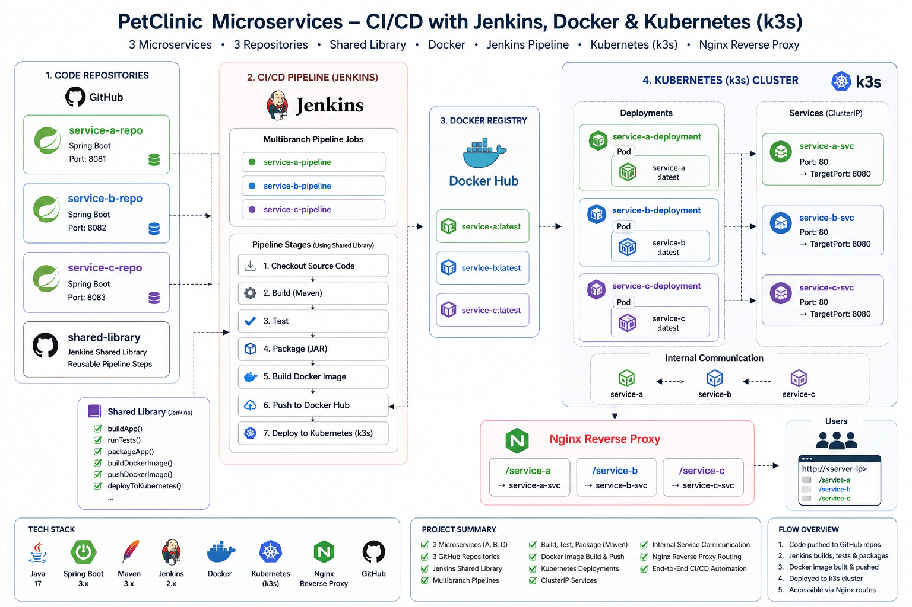

# PetClinic Microservices DevOps Project

This project demonstrates a complete end-to-end DevOps pipeline for deploying microservices using Jenkins, Docker, and Kubernetes (k3s).

---

## Architecture Overview

* 3 Microservices (Service A, B, C)
* Jenkins Shared Library
* Docker Hub Registry
* Kubernetes (k3s Cluster)
* Nginx Reverse Proxy

---

## CI/CD Workflow

1. Code is pushed to GitHub repositories
2. Jenkins pipeline is triggered
3. Application is built using Maven
4. Tests are executed
5. JAR file is packaged
6. Docker image is built
7. Image is pushed to Docker Hub
8. Application is deployed

---

## Repositories

* Service A
  https://github.com/ReemNabil1/petclinic-service-a

* Service B
  https://github.com/ReemNabil1/petclinic-service-b

* Service C
  https://github.com/ReemNabil1/petclinic-service-c

* Jenkins Shared Library
  https://github.com/ReemNabil1/jenkins-shared-lib

---

## 🐳 Docker Images

* reemnabil/service-a:latest
* reemnabil/service-b:latest
* reemnabil/service-c:latest

---

## ☸️ Kubernetes (k3s)

Each microservice includes:

* Deployment
* ClusterIP Service

Test internally:

```
kubectl run test-curl --image=curlimages/curl -it --rm -- sh
```

---

## 🌐 Reverse Proxy (Nginx)

Routes:

* /service-a → service-a
* /service-b → service-b
* /service-c → service-c

---

## Tech Stack

* Jenkins
* Docker
* Kubernetes (k3s)
* Nginx
* Maven
* Spring Boot

---

## Architecture Diagram



---

## Key Learnings

* Building reusable Jenkins pipelines
* Dockerizing microservices
* Kubernetes deployments and services
* Debugging networking issues
* Reverse proxy configuration

---

